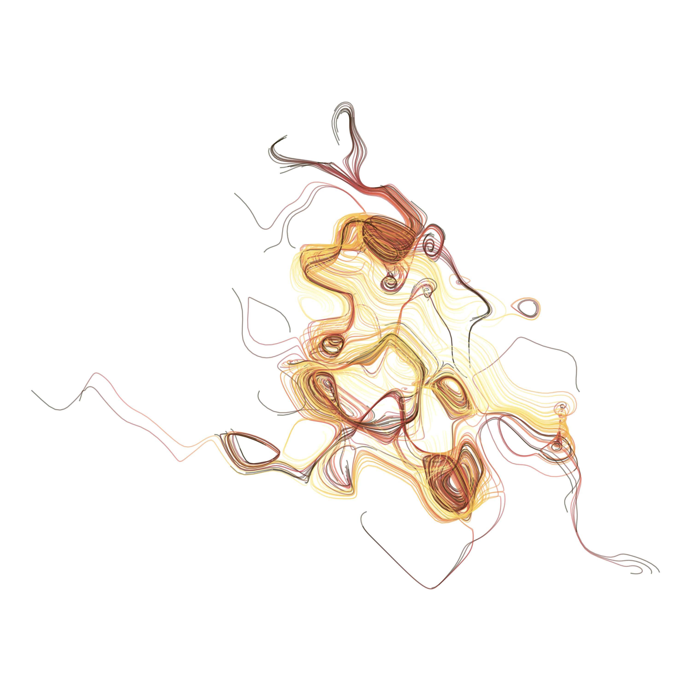

# art

This is a repo for holding art done programatically.

## Scrawl

For the moment, it just features a piece of R code from [this course](https://www.youtube.com/watch?v=ZUyahWLWVzY&list=PLRPB0ZzEYegNYW3ksiK3dvd6S4HMfKj1n) by [Danielle Navarro](https://djnavarro.net/).

The scrawl - as it is called by her author - combines ggplot, random numbers and a bit of programming in order to produce outputs like the one below:

